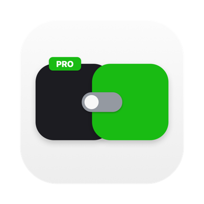
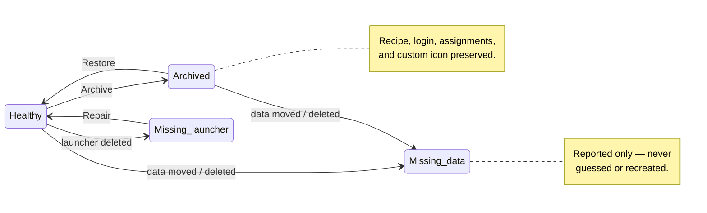
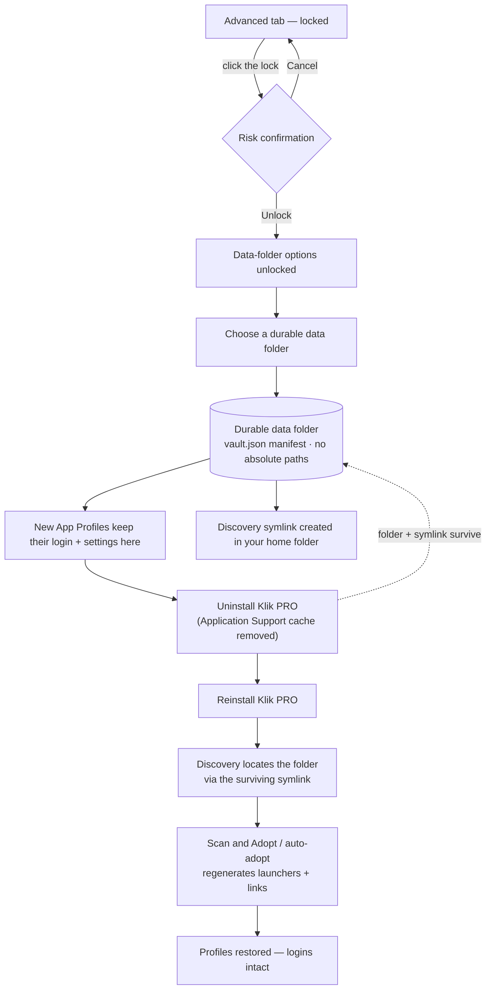

<div align="center">



# Klik PRO

**Recordable mouse-button shortcuts and isolated App Profiles for macOS — a lightweight,
native menu-bar utility, with thumb-wheel tab switching and a keep-awake menu.**

[](https://github.com/AminudinMurad/klik-pro/releases/latest)
[](LICENSE)


**This app is open source under the GNU General Public License v3.0. If Klik PRO improves your workflow,
help support continued development and mouse/browser compatibility testing:**

[](https://github.com/sponsors/aminudinmurad)
[](https://ko-fi.com/aminudinmurad)
[](https://www.paypal.com/paypalme/aminudinmurad)

[Features](#features) · [Install](#install-pre-built-release) · [Shortcuts](#default-shortcuts) · [App Profiles](#app-profiles) · [Advanced](#advanced-tab) · [Changelog](CHANGELOG.md) · [How it works](#how-it-works) · [Building](#building) · [Tested with](#tested-with) · [Support](#support-development) · [Contributing](#contributing) · [License](#license)

</div>

Klik PRO remaps middle, forward, and back mouse-button events to recordable keyboard
shortcuts. On supported device profiles, enabling Gesture replaces the mouse's standard
`⌘Tab` output with the configured Klik PRO shortcut; the physical keyboard's `⌘Tab`
remains unchanged. The horizontal thumb wheel provides configurable browser-tab
switching. Left- and right-click are left untouched.

It's a small always-on background helper that does the remapping, plus a settings
app for recording supported mouse-button shortcuts and checking for conflicts. Its
adaptive Klik PRO menu-bar icon opens Settings with a left-click; right-click provides
Settings, About, and Quit. It can be hidden from Settings, and two green button dots
appear only while its Accessibility input tap is operational. The optional
**ChatGPT / Codex & Claude Quick Launch** feature adds separate launcher icons and
hotkeys, and can temporarily link either launcher to a supported mouse button without
replacing that button's normal mapping. Its icons can be hidden while its hotkeys and
assigned buttons remain active. Actual button and wheel support varies by hardware.

**Guided onboarding** — a three-step first-launch flow (Welcome → Preferences →
an opt-in Accessibility step), with Back navigation and no dead-ends:

<p align="center">
  
</p>

**Supported controls** — configure compatible mouse controls and see live conflict
checks:


**App Profiles** — generate isolated extra instances of ChatGPT or Claude, each with
its own login; open or assign each profile, and give it a custom PNG/ICO, colour tint,
or initial badge so every account is recognisable at a glance:


**Icon customisation** — distinguish profiles with colour tints or initial badges,
manage them from the per-profile gear menu, and see the same identity immediately in
Mappings:

<p align="center">
  
</p>

**Settings** — launch-at-login, menu-icon visibility, update-check, and guided Accessibility setup/reset controls:


**Advanced — durable data folder (lock-gated).** The Advanced tab is locked by default. Its options change where App Profile data is stored on disk, so clicking the padlock shows a risk confirmation before anything unlocks:


Once unlocked, point new App Profiles at a durable data folder so their logins survive uninstalling Klik PRO, scan an existing folder to recover profiles after a reinstall, and review profile health. Missing launchers can be repaired; active profiles can be archived without deleting their login data or custom icon, then restored later with the same identity:


## Features

- **Four recordable button shortcuts on the tested mouse** — middle, Gesture,
  forward, and back. When enabled, Gesture overrides the mouse's standard `⌘Tab`
  output with its configured shortcut without changing keyboard `⌘Tab`. Left- and
  right-click are never touched.
- **Live conflict checking** — flags duplicate assignments, reserved macOS
  shortcuts, configured browser-extension commands, and combos already claimed
  system-wide as you record them.
- **Thumb-wheel tab switching** — the horizontal wheel flips browser tabs, with
  per-browser combinations and a sensible fallback elsewhere.
- **Save applies instantly** — no manual restart; the background helper restarts
  automatically on save.
- **Configurable Klik PRO menu-bar icon** — left-click opens Settings; right-click
  provides Settings, About, and Quit. It adapts to light, dark, selected, and inactive
  menu bars, shows two green button dots only while the main Accessibility input tap
  is active, and can be hidden from Settings.
- **Native & lightweight** — Swift + AppKit/Carbon, no dependencies or vendor
  drivers; standard controls use macOS event taps and Gesture uses a device-scoped
  macOS HID key map.
- **Optional ChatGPT / Codex & Claude Quick Launch** — adds separate launcher icons +
  global hotkeys for ChatGPT / Codex and Claude. Each launcher can also be linked to
  Middle, Gesture, Forward, or Back while preserving that button's normal mapping
  underneath. New configurations start with Forward assigned to ChatGPT / Codex and
  Back assigned to Claude; both remain changeable or removable through **None**.
  Its launcher icons can be hidden independently while the hotkeys and assigned mouse
  buttons continue working.
  Its master toggle is available only when ChatGPT / Codex or Claude is installed;
  launcher wrappers alone do not count. Each app-specific hotkey and picker clearly
  disables when its app or launcher wrapper is missing; a stale picker assignment
  can still be cleared with **None**.
- **App Profiles** — generate a second icon for ChatGPT or Claude with its own separate
  login and settings. The original app is never copied, cloned, or modified. Each
  generated launcher can be renamed; styled with a custom PNG/ICO, one of six colour
  tints, or an initial badge; pinned to the Dock or menu bar; assigned to a mouse
  button; or removed at any time. Its identity stays consistent across App Profiles,
  Mappings, the menu bar, Launchpad, and Finder. See [App Profiles](#app-profiles).
- **App Profile data and maintenance** — Advanced reports whether each managed
  profile is healthy, missing its launcher, missing its data, or archived. Repair
  safely rebuilds a missing launcher; Archive removes runtime access while preserving
  login data, assignments, identity, and custom artwork; Restore brings it back.
  Delete Data now separates **Remove Icons (Keep Data)** from **Delete All Data**:
  both clear the launcher, Dock, Launchpad, and menu-bar presence, while only Delete
  All Data removes validated login/profile data. Stale entries can be forgotten
  without touching data, while marker-owned orphaned data can be reviewed and moved
  to Trash or permanently deleted after explicit confirmation and fail-closed
  ownership and in-use checks.
- **Caffeinate** — an optional keep-awake menu on the Klik PRO menu-bar icon
  (30 minutes, 1 hour, 2 hours, or until turned off), powered by macOS's own
  `caffeinate`, with a coffee-cup status icon while active.
- **In-app update check** — notifies you when a newer GitHub release is available.

## Install (pre-built release)

The current release is **Klik PRO v1.2.7 (build 11)**, provided as one universal
macOS app for Apple Silicon and Intel Macs. The DMG is the recommended download;
the ZIP contains the same app as an alternative.
**[Download Klik PRO v1.2.7](https://github.com/AminudinMurad/klik-pro/releases/tag/v1.2.7).**

> [!IMPORTANT]
> **Update if you use App Profiles.** Version 1.2.7 improves custom PNG app-profile
> icon scaling in Dock and Launchpad, and keeps the v1.2.6 fix for generated ChatGPT
> launchers that worked from the menu bar but not from Dock or Launchpad.

Klik PRO is **not notarized or signed with an Apple Developer ID** — it's an
ad-hoc-signed, self-built utility — so a downloaded copy is quarantined and
Gatekeeper blocks it on first launch. That's expected for any non-notarized app.

### Verified Terminal installer

Starting with releases that include a signed checksum, the recommended Terminal
path authenticates the DMG before bypassing Gatekeeper. Download the installer,
inspect it, and run it as separate steps — never pipe a network response into a shell:

```zsh
curl --proto '=https' --tlsv1.2 -fLO \
  https://raw.githubusercontent.com/AminudinMurad/klik-pro/main/install.sh
less install.sh
chmod +x install.sh
./install.sh
```

The installer verifies the checksum with the dedicated Klik PRO Ed25519 release key,
checks the DMG, both bundle identifiers and versions, universal architectures, and
code-signature integrity, then asks before staging the app in `/Applications` and
removing quarantine. Existing configuration and logs are preserved. Release-key
fingerprint: `SHA256:Evg4ITqpPJY/aIT48Zv9Cp3psQfo977uCz/35a2k79E`.
After installation succeeds, it opens Klik PRO automatically; continue with the
first-launch steps below. This installer workflow has been tested from a fully clean
state as well as against an older two-service installation.

### Manual installation

To install manually through the standard macOS interface:

1. Download the universal macOS DMG from the latest
   [release](https://github.com/AminudinMurad/klik-pro/releases/latest), open it,
   then drag `Klik PRO.app` onto the **Applications** shortcut shown in the Finder
   window. Alternatively,
   extract the universal ZIP and move `Klik PRO.app` to `/Applications`.
2. Double-click it. macOS says *"Klik PRO can't be opened because Apple cannot
   check it for malicious software."* Click **Done** — do **not** move it to Trash.
3. Open **System Settings → Privacy & Security**, scroll to **Security**, find
   *"Klik PRO was blocked…"*, click **Open Anyway**, authenticate, and confirm.
   *(On macOS 15+ the old right-click → Open shortcut no longer bypasses Gatekeeper
   for unsigned apps — use this Settings flow.)*

   Or clear the quarantine flag from Terminal:
   ```zsh
   xattr -dr com.apple.quarantine "/Applications/Klik PRO.app"
   ```
Continue with the same first-launch steps used by the Terminal installer.

### First launch and Accessibility

1. The welcome sheet should report **Accessibility — Setup required**. Click
   **Set Up Accessibility…**. Klik PRO creates and starts its single combined
   background helper, asks the actual input helper to register the correct
   **Klik PRO Helper.app** entry, and opens **System Settings → Privacy & Security →
   Accessibility**.
2. Turn **Klik PRO Helper.app** on. macOS may require Touch ID or the account password;
   Klik PRO cannot approve this security permission itself.
3. Return to Klik PRO. The status normally updates automatically; click **Recheck** if
   macOS has not reported **Granted** yet.
4. A fresh installation uses only `local.klik-pro.input`. Upgrading from an
   older release automatically unloads and removes the obsolete
   `local.klik-pro.menu` service.

Choosing **View Mappings** keeps onboarding open as a review: use the visible
**Back to Welcome** button in the footer to return and continue setup. See
[`docs/INSTALL.md`](docs/INSTALL.md) for repair steps, logs, and the confirmed
**Reset Access…** workflow.

The **Settings** tab keeps these Accessibility controls under its **Permissions**
section (each is also shown as a hover tooltip):

| Control | What it does |
|---|---|
| **Set Up Accessibility… / Open Accessibility…** | Opens the Accessibility permission list in System Settings. On first setup it also registers the correct Klik PRO Helper entry. |
| **Recheck** | Re-checks whether Klik PRO Helper currently has Accessibility permission. |
| **Reset Access…** | Clears Klik PRO Helper's Accessibility permission and restarts the guided setup. |

**After an update.** Klik PRO is ad-hoc signed, so each update changes the helper's
code signature and macOS quietly drops its Accessibility grant — even though the old
**Klik PRO Helper** entry may still look enabled. When that happens Klik PRO shows a
short guidance dialog with a **Register Helper** button. Because the helper lives
*inside* the app bundle (`Klik PRO.app/Contents/Helpers/`), it can't be added by hand
with the **+** button in System Settings; **Register Helper** re-registers the current
helper so macOS lists — and prompts for — the correct toggle right away. Then remove
any stale **Klik PRO Helper** entry with **−** and turn the newly listed one on.

Prefer to compile it yourself? See [Building](#building).

## Default shortcuts

| Buttons & Scroll Wheels | Klik PRO default key combination | System Default / Routing |
|---|---|---|
| **Middle Button** (scroll-wheel click) | ⇧⌘7 | Native middle click |
| **Gesture Button** | ⇧⌘6 | ⌘Tab |
| **Forward Button** | ⌘] (fallback) | Native Forward side-button event |
| **Back Button** | ⌘[ (fallback) | Native Back side-button event |
| **Horizontal Thumb Wheel** | ⌘⌥← / ⌘⌥→, with ⇧⌘← / ⇧⌘→ for a supported browser override | Native horizontal scrolling |

### Browser Back and Forward

Default Back and Forward use the original side-button events in compatible browsers,
so browser extensions cannot claim synthetic keyboard shortcuts. The recorded combo is
only a fallback; custom assignments are always sent exactly as recorded.

### Editing and saving shortcuts

- Recordable button shortcuts are remappable and checked for duplicate, reserved,
  browser-extension, and system-wide conflicts.
- The ↶ control restores a shortcut's original Klik PRO combination.
- Thumb-wheel tab switching can be enabled separately for each supported browser.
- Every state-changing toggle, shortcut field, dropdown, and reset control rechecks the
  red **Unsaved changes** note. **Save** clears it after a successful write; restoring
  the saved or opening values also clears it.

### ChatGPT / Codex & Claude Quick Launch

- The independently recordable hotkeys default to ⌃⌥⌘G and ⌃⌥⌘C.
- On a new configuration, **Forward** opens ChatGPT / Codex and **Back** opens Claude
  while the Special Feature is on. Choosing **None**, another button, or turning the
  feature off restores the normal saved button behavior.
- Each app has a **Mouse Button** menu with **None**, **Middle**, **Gesture**,
  **Forward**, and **Back**. One button cannot serve both apps.
- A linked button mirrors its launcher hotkey. Turning the feature off, selecting
  **None**, or losing the launcher restores that button's normal mapping.
- The master toggle requires at least one supported app. Klik PRO refreshes app and
  launcher availability while open; unavailable existing assignments remain removable
  through **None**.

## How it works

Klik PRO is one compiled input helper, automatically registered as a single per-user
LaunchAgent, plus a separate settings app:

- **Input helper** (`Sources/KlikProInput.swift`) — runs from a small
  **`Klik PRO Helper.app`** bundle nested inside `Klik PRO.app`, so its
  **Accessibility** entry shows "Klik PRO Helper" with the app icon rather than a
  bare binary name. The helper is launched by the single `local.klik-pro.input`
  LaunchAgent, which owns the mouse's extra buttons, device-isolated Gesture sentinel,
  thumb wheel, persistent Klik PRO status icon, and (when Special Feature is enabled)
  the ChatGPT / Codex and Claude launcher icons and global hotkeys. The settings app
  writes this service definition automatically before setup; the helper reads the
  saved Special Feature setting and enables or disables the optional capabilities in
  the same process. Upgrades automatically unload and remove the legacy separate menu
  helper, if one is still installed.
- **Settings app** (`Sources/KlikProApp.swift`) — a small AppKit window with four
  tabs—Mappings, Settings, App Profiles, and a lock-gated Advanced tab—plus a
  one-time welcome sheet for fresh installations. The sheet
  explains the required Accessibility approval, the ready-to-try defaults, and where
  to customize them. **Mappings** records shortcuts for the four supported mouse controls,
  toggles them on/off, checks for conflicts, switches the optional Quick Launch toggle,
  and links ChatGPT / Codex or Claude to a supported mouse button when requested.
  **Settings** covers
  launch-at-login, main and Special Feature menu-icon visibility, automatic update
  checks, and guided Accessibility setup with live status, a manual **Recheck** action,
  and a confirmed reset that
  restarts onboarding. The
  header has a **Check for Updates** button (lights up when a newer GitHub release
  exists), and the footer links to the project's GitHub repo and its GitHub
  Sponsors / Ko-fi / PayPal support pages.

For browser-local conflict warnings, the settings app reads local supported-browser
profile `Preferences` files, extracts and retains only configured extension shortcut
keys, and never modifies, logs, or transmits their contents.

Everything is config-driven — see `Sources/KlikProConfig.swift` for the shared
model both executables read, persisted to:

```text
~/Library/Application Support/Klik PRO/config.json
```

## App Profiles

The dedicated **App Profiles** tab fills the window height and places the ChatGPT and
Claude generators in the left column and the scrollable profile-management list in
the right. Click **Generate**, accept or edit the suggested name, and Klik PRO
creates a small launcher with a separate login and settings, then opens it. The
original app in `/Applications` is never copied, cloned, renamed, or modified.

The **Mappings** tab uses the same two-column structure: mouse-button shortcuts and
thumb-wheel tab switching stay on the left, while a scrollable profile list on the
right provides **Open** and **Assign Button** for each profile. Both tabs render the
same current profile icon immediately after a change. The remaining management
actions and the **Menu Bar Icon** toggle stay on the App Profiles tab.

For generated profiles, the gear menu groups **Rename**, **Change Icon**, and
**Remove from Klik PRO**. **Change Icon** accepts PNG or ICO artwork, offers six
colour tints of the original app icon, and can add a coloured corner badge using the
profile's initial; the live preview shows the result before it is applied. **Reset to
App Icon** restores the source app artwork. Custom icon data is kept with the profile
and survives durable-folder recovery; the original ChatGPT or Claude app remains
untouched.

The naming dialog includes an unchecked **Add launcher icon to Dock** option for
users who want the generated launcher pinned immediately. Each row in **Your App
Profiles** ends with a **Menu bar** toggle (the rightmost control) for showing or
hiding that instance in Klik PRO's menu-bar launchers. These menu-bar controls are
independent of **Launch at login**: disabling automatic startup does not hide the
icons that are already running in the current session.

If an App Profile already owns a mouse button, its **Assign Button** control shows
that button as its own label — for example **Forward Button** — with a chain-link
icon, and switches to **Change ⋯** on hover. A profile with no button assigned shows
a link-with-plus icon on **Assign Button**.

On fresh launch, the App Profiles tab shows one **Scanning installed apps…** spinner
while Klik PRO scans installed applications, then switches to the ChatGPT and
Claude cards. **Refresh App List**, in the panel's top-right, rescans installed
apps and refreshes the profile list if ChatGPT or Claude is installed or removed
while Klik PRO is already open.

Generated launchers use the name you choose for their visible `.app` icon, while
their profile data remains safely UUID-keyed inside Klik PRO's Application Support
folder. Profiles whose isolation uses a separate home folder also get a visible
link in your home directory — for example a "Claude A" profile appears as
`~/.claude-a` — so multi-account tools that scan for CLI profile folders can
detect them. The link points at the real UUID-keyed data and is removed with the
profile; existing hand-made folders with the same name are never touched.
Profiles generated by an earlier version gain their folder and link
automatically, in place, the next time the Klik PRO app opens — no removal or
regeneration needed.

Opening a running profile from Klik PRO, its menu-bar icon, the Dock, Launchpad, or
Finder reopens that profile's window and brings the same process forward instead of
starting a duplicate. Existing generated launchers are refreshed in place when used,
without changing their profile data or login. A pinned Dock tile may continue showing
macOS's cached old icon until that tile is clicked or the user next logs in; the menu
bar, Launchpad, Finder, App Profiles, and Mappings update immediately.

Existing ChatGPT and Claude launchers remain untouched and appear under **Your App
Profiles** with **Open** and **Assign Button**. Generated entries also offer
**Rename** and **Remove from Klik PRO** — Remove deletes the generated launcher and
managed entry, but keeps its login/profile data on disk for recovery. **Delete Data**
in Advanced first asks whether to **Remove Icons (Keep Data)** or **Delete All Data**.
Both choices clear the launcher, Dock tile, Launchpad entry, and menu-bar icon; Delete
All Data then removes validated profile data after offering Move to Trash or Delete
Permanently. Assigning a button on either tab updates the other immediately. The four
working mouse controls can each be set to a **Keyboard Shortcut** or **Open App**,
while thumb-wheel browser switching is unchanged. Only installed apps on Klik PRO's
small, human-tested list are shown; there is no general app search, unsupported-app
list, Browse flow, or Convert action.

## Advanced tab

The **Advanced** tab is lock-gated: because its options change where App Profile data
lives on disk, clicking the padlock shows a risk confirmation before anything unlocks.
Once unlocked it provides a **durable data folder** for App Profile storage,
**App Profile Maintenance**, where every managed profile is classified and offered a
single safe action, and **Deep Scan for Leftovers** for safely finding owned artifacts
whose profiles are no longer tracked. Accessibility and other macOS permissions live
on the **Settings** tab, not here.

### Repair, archive, and restore

Unlock **Advanced** to open **App Profile Maintenance**. Every managed profile is
classified independently, with a safe action offered for each state:

| Status | What it means | What you can do |
|---|---|---|
| **Healthy** | Owned data and generated launcher both validate. | Use it normally. |
| **Missing launcher — repair available** | Login data is intact; only the launcher is gone (for example, deleted in Finder). | **Repair** rebuilds just the launcher — the login is unchanged. |
| **Archived — data preserved** | Launcher and runtime assignments are inactive; the profile recipe, login data, assignment choices, and custom icon are all kept. | **Restore** brings it back with the same identity and icon. |
| **Profile data is missing** | Klik PRO reports the problem and refuses to guess or recreate your data. | Reported only — restore or relocate the data yourself. |



Archive and Restore remain non-destructive. Data removal is limited to validated,
Klik PRO-owned profile artifacts and requires an explicit Trash or permanent-delete
confirmation; ambiguous, markerless, or in-use data fails closed. The configuration
remains the source of truth, while the vault
manifest and generated launchers are derived state that Klik PRO safely reconciles
after an interrupted operation or relaunch.

**Deep Scan for Leftovers** checks only Klik PRO-owned locations and UUID-keyed
artifacts. It can find orphaned profile folders, persisted custom-icon copies, lock
files, safely generated launchers, and stale Dock tiles pointing directly into Klik
PRO's managed launcher folder. Results can be moved to Trash, or permanently deleted
after a second destructive confirmation. Active profiles, arbitrary apps, markerless
data, and paths outside Klik PRO's controlled roots are excluded.

### How the durable data folder works

The Advanced tab keeps its data-location controls behind a lock and a risk
confirmation. Once you choose a durable folder, new App Profiles are stored there —
outside Klik PRO's Application Support — so their logins **survive uninstalling,
reinstalling, or moving to a new Mac**. Existing profiles are never moved.



## Roadmap

Possible directions for future releases — not committed, and subject to change:

- **More apps for App Profiles.** Extend isolated App Profiles beyond ChatGPT and
  Claude to additional supported apps.
- **Built-in system controls.** Preconfigured actions you can assign to a mouse button
  — brightness, volume, media playback, and the like — without recording a keyboard
  shortcut yourself.

Have a request? [Open an issue](https://github.com/AminudinMurad/klik-pro/issues).

## Building

```zsh
./tools/check.sh
./tools/build-release.sh
```

The builder produces verified universal Apple Silicon + Intel DMG and ZIP downloads
with an explicit macOS 13 deployment target. The DMG provides a guided
drag-to-Applications layout with technical repair files tucked into **Extras**.
The input helper is packaged into a nested
`Klik PRO Helper.app` inside `Klik PRO.app` and runs all background capabilities from
one LaunchAgent. See [`docs/INSTALL.md`](docs/INSTALL.md) for the full build,
Gatekeeper, LaunchAgent, Accessibility, logging, and config details.

## Repo layout

- `Sources/` — the two Swift executables plus the shared config model.
- `LaunchAgents/` — the `launchd` plist for the combined input and optional launcher helper.
- `App/` — the app bundle's `Info.plist`.
- `assets/` — shared frosted-white mouse master, the generated centered app icon
  with its overlapping PRO badge and soft bottom fade shadow, the device illustration,
  and the settings previews above.
- `Tests/` — focused standalone regression checks.
- `tools/` — verification, reproducible device/icon artwork, previews, and release packaging.
- `diagnostics/` — probes for inspecting how a given mouse's buttons and thumb
  wheel report to macOS (a development aid, not part of the shipped app).
- `docs/` — install/setup notes.
- `CHANGELOG.md` — user-facing release history.

## Tested with

Behavior on a programmable mouse is hardware- and macOS-dependent, so these are the
setups Klik PRO has been tested against:

| | |
|---|---|
| macOS | 26.5.2 (build 25F84) |
| Klik PRO | v1.2.7 (build 11), universal Apple Silicon + Intel build |
| Primary mouse | Logitech MX Master 3 (Mac edition), firmware `MPM19.01_0015`, connected over Bluetooth (BLE) |
| Additional tested mouse | Logi M650, firmware `RBM16.10_0014` |
| Vendor software / driver | None — no mouse driver or manufacturer software installed |
| ChatGPT / Codex desktop app (Special Feature target) | `/Applications/ChatGPT.app` — version `26.715.72359` (build `5718`), bundle ID `com.openai.codex` |
| Claude Desktop app (Special Feature target) | `/Applications/Claude.app` — version/build `1.24012.1`, bundle ID `com.anthropic.claudefordesktop` |
| Browsers (thumb-wheel tab switching) | Google Chrome `150.0.7871.115`, Brave `150.1.92.139`, Firefox `152.0.5`, Safari `26.5.2` |
| Browser Back/Forward routing | Native side-button navigation in Chrome, Brave, and Firefox; Safari fallback uses Back `⌘[` and Forward `⌘]` |

The Special Feature validates those exact standard desktop-app paths and bundle IDs.
Its separate second-instance launcher wrappers are still required for launching, but
do not count as installed desktop apps.

The generic middle and forward/back controls have also been tested with the Logi M650.
Gesture isolation currently targets only the tested MX Master 3 Mac
(`0x046D:0xB023`). The horizontal thumb wheel is hardware-specific — use the tools in
`diagnostics/` to check
how your mouse reports before adapting. Product names are referenced for compatibility
only (see [NOTICE.md](NOTICE.md)).

## Adapting to a different mouse

Button naming, thumb-wheel behavior, and the device-isolated Gesture path in
`Sources/KlikProInput.swift` were developed for the Logitech MX Master 3 Mac profile;
the generic controls were additionally checked on the Logi M650. If you're adapting
this for a different device, start with the tools in `diagnostics/` to see how your
mouse's buttons and wheel actually report to macOS before changing the mapping logic.

## Support development

Optional tips and other support help fund continued development, compatibility
testing, and future mouse support:

- [GitHub Sponsors](https://github.com/sponsors/aminudinmurad) — recurring support
- [Ko-fi](https://ko-fi.com/aminudinmurad) — quick one-time support
- [PayPal](https://www.paypal.com/paypalme/aminudinmurad) — direct support

Thank you for helping keep Klik PRO improving and freely available.

## Contributing

Contributions are welcome. See [CONTRIBUTING.md](CONTRIBUTING.md) for how to build,
preview, and verify changes; please follow the
[Code of Conduct](CODE_OF_CONDUCT.md). To report a security issue privately, see
[SECURITY.md](SECURITY.md).

## Trademark notice

**Not affiliated with Logitech.** "Logitech", "MX Master", and "Options+" are
trademarks of Logitech International S.A.

References to specific compatible hardware describe compatibility only. Other product
names and trademarks remain the property of their respective owners.

## License

Copyright © 2026 Aminudin Murad. This app is open source under the GNU General
Public License v3.0. See [LICENSE](LICENSE).
