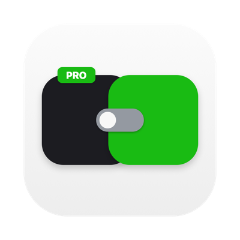
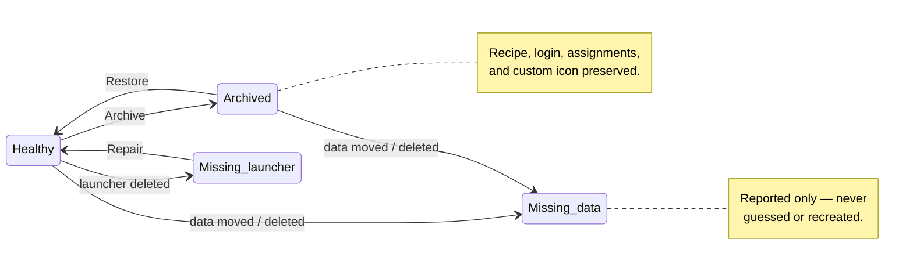
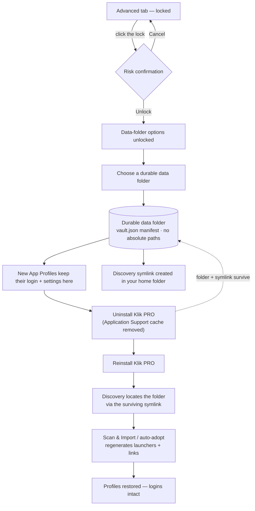

<div align="center">



# Klik PRO

**App Profiles beyond ChatGPT and Claude, three saved mouse-mapping presets, and
launcher cards for macOS — a lightweight native menu-bar utility with thumb-wheel
tab switching.**

[](https://github.com/AminudinMurad/klik-pro/releases/latest)
[](LICENSE)


**This app is open source under the GNU General Public License v3.0. If Klik PRO improves your workflow,
help support continued development and mouse/browser compatibility testing:**

[](https://github.com/sponsors/aminudinmurad)
[](https://ko-fi.com/aminudinmurad)
[](https://www.paypal.com/paypalme/aminudinmurad)

[Features](#features) · [Install](#install-pre-built-release) · [Fresh defaults](#fresh-install-defaults) · [App Profiles](#app-profiles) · [Advanced](#advanced-tab) · [Changelog](CHANGELOG.md) · [How it works](#how-it-works) · [Building](#building) · [Tested with](#tested-with) · [Support](#support-development) · [Contributing](#contributing) · [License](#license)

</div>

Klik PRO is no longer limited to ChatGPT / Codex and Claude. The v1.5.6 dashboard
keeps the compact 940-point width on every MacBook and offers five height choices,
so longer app lists can use more vertical space without stretching the layout. It
also includes the expanded installed-app catalogue introduced in v1.5.0 and the
reduced background CPU use introduced in v1.5.1.
Supported tools include Gemini, Canva, Zoom, Spotify, browsers, editors, and work
apps, with compatibility badges and clear per-app actions. It also adds three saved
mouse-mapping slides, explicit
**Save** and **Activate** behavior, quieter fresh defaults, and a cleaner app-card
layout across Mappings and App Profiles.

The v1.5.3 dashboard refines that responsive workspace: Mouse Mappings
uses five compact control cards around the centred mouse, the header groups
disk-icon Save, Close, and Power Off actions, and the removed action footer gives
the mapping slide more vertical breathing room. Updates now lives in Settings >
About. v1.5.4 corrects that dashboard with fully visible Browser arrow values,
removes the misleading status badge from Horizontal Thumb Wheel, and restores
mapping-specific colour and depth to the carousel. v1.5.5 hardens authenticated
upgrades by requiring the staged and installed main/helper executables to match
the verified DMG byte for byte before the rollback copy is discarded. v1.5.6
locks manual resizing to the same 940-point width and renames Best Fit to
Dashboard Height. The
sender-aware,
mouse-independent profile work remains reserved for v1.6.

Klik PRO remaps supported middle, forward, back, and Gesture mouse-button events to
the currently active saved mapping preset. Enabling Gesture replaces the tested
mouse's standard `⌘Tab` output with the configured Klik PRO shortcut; the physical
keyboard's `⌘Tab` remains unchanged. The horizontal thumb wheel provides configurable
browser-tab switching. Left- and right-click are left untouched.

The three mapping slides are presets, not yet true hardware profiles: connected mice
share the one active preset. A future sender-aware device-routing implementation is
planned separately in [`docs/TRUE_MOUSE_PROFILE_PLAN.md`](docs/TRUE_MOUSE_PROFILE_PLAN.md).

It's a small always-on background helper that does the remapping, plus a settings
app for recording supported mouse-button shortcuts and checking for conflicts. Its
adaptive Klik PRO menu-bar icon opens Settings with a left-click; right-click provides
Settings, About, and Quit. It can be hidden from Settings, and two green button dots
appear only while its Accessibility input tap is operational. Optional native-app
launchers add separate icons, user-recorded hotkeys for ChatGPT / Codex, Claude, and
Gemini, and temporary mouse-button launch actions where supported. Actual button and
wheel support varies by hardware.

## v1.5.6 highlights

- **Fixed 940-point width** — every MacBook choice preserves the compact,
  readable 13-inch dashboard width.
- **Height-only MacBook choices** — 13-inch M1, 13-inch M2+, 14-inch, 15-inch,
  and 16-inch now apply heights of 770, 820, 860, 900, and 960 points.
- **Vertical manual resizing** — width remains locked while height can be
  adjusted continuously across the supported range.
- **Dashboard Height settings** — clearer wording replaces screen-size guidance
  and reports non-preset heights as Custom height.
- **Smaller thumb-wheel card** — Mappings keeps the Horizontal Thumb Wheel toggle
  and title compact, with a small globe menu for quickly enabling browsers.
- **Centred device artwork** — the mouse now sits on the horizontal and vertical
  centre of the mapping slider, with the four surrounding cards raised into a
  vertically centred group.
- **Sequence-aware slide dots** — dots now sit before or after the current mapping
  name to show its actual first, middle, or final position.

## v1.5.5 highlights

- **Exact executable identity after installation** — the Terminal installer
  compares the main app and nested helper against the authenticated DMG after
  staging and again after activation.
- **Fail-safe upgrade rollback** — an executable mismatch aborts the upgrade
  while the previous app is still available for automatic restoration.
- **Corrected mapping dashboard retained** — Horizontal Thumb Wheel has no
  misleading `OK`, Browser ←/→ values fit, and mapping slides keep their colour
  wash, gradients, highlights, and card depth.
- **Runtime behavior remains stable** — configuration, mouse routing, App
  Profiles, responsive sizes, and the v1.6 boundary are unchanged.

## v1.5.4 highlights

- **Clear Forward and Back controls** — both action menus consistently say
  Shortcut, while the complete Browser → and Browser ← values remain visible
  beside their reset controls.
- **Honest thumb-wheel state** — Horizontal Thumb Wheel no longer displays an
  `OK` badge because browser selection has no shortcut-conflict status to validate.
- **Mapping slides have depth again** — each saved mapping carries its own subtle
  colour wash, while gradients, highlights, and restrained shadows separate the
  five mapping cards from the carousel.
- **Behavior remains stable** — mouse routing, saved configuration, responsive
  window sizes, and the v1.6 mouse-independent profile boundary are unchanged.

## v1.5.3 highlights

- **Selected five-card mapping layout** — four button cards surround the mouse,
  with Horizontal Thumb Wheel in a matching top-centre card.
- **One aligned control row per card** — action, shortcut/app value, and reset
  remain compact without losing the existing Open App and conflict behavior.
- **Compact header actions** — disk-icon Save, Close, and Power Off sit together
  with compact state feedback; the detached footer band is removed.
- **Close remains safe; Power Off is explicit** — Close and normal Quit routes
  protect unsaved edits with Save, Discard, and Cancel. Power Off confirms before
  stopping the helper and turning off Launch at login.
- **Focused Settings actions** — Updates is inside About, while Accessibility
  status and its four actions use one aligned row instead of scattered controls.
- **Visual Best Fit tiles** — the five MacBook targets show their exact Klik PRO
  outer-frame sizes, active state, and resizable-window guidance at a glance.
- **Responsive range retained in v1.5.3** — the 940×770 minimum, five Best Fit
  choices, remembered frame, and then-current 1280×960 maximum were unchanged.
- **v1.6 stays separate** — no sender-aware device routing or mouse-independent
  profile behavior is included.

## v1.5.2 highlights

- **Responsive without raising the minimum** — the current 940×770-point
  13-inch layout remains the smallest supported frame.
- **Normal macOS resizing** — expand the dashboard continuously up to
  1280×960 points; the last frame is remembered and constrained to the current
  screen.
- **Five Best Fit presets** — Settings offers suggested frames for 13-inch M1,
  13-inch M2+, 14-inch, 15-inch, and 16-inch MacBooks without locking the window.
- **Long-list capacity scales with height** — Native Apps, App Profiles,
  generator, and Advanced maintenance lists receive the added viewport instead
  of leaving unused space.
- **v1.6 stays separate** — mouse-independent profiles are not part of this
  layout release.

## v1.5.1 highlights

- **Lower idle CPU use** — unchanged profile files no longer trigger full
  code-signature validation every five seconds; startup, changed-file, and
  pre-launch validation remain in place.
- **Fits a 13-inch MacBook** — the complete 940×770-point dashboard fits the
  default 1440×900 workspace without an outer scrollbar.
- **Cleaner Advanced layout** — aligned top cards, contained action buttons,
  consistent spacing, an internal maintenance scroller, and no detached blank
  band above Save and Close.
- **No longer ChatGPT/Claude-only** — App Profiles now starts from a broader
  installed-app catalogue, including Gemini, Canva, Zoom, Spotify, browsers, editors,
  and work apps.
- **Three saved mapping presets** — each preset keeps its own buttons, shortcuts,
  Open App targets, browser checkboxes, and colour.
- **Explicit Save and Activate** — edit a slide safely, save it when ready, then
  activate exactly one live preset for the helper.
- **Quiet fresh defaults** — Middle, Gesture, thumb-wheel switching, browser
  checkboxes, app assignments, and app hotkeys start off; Forward and Back keep
  browser-history defaults.
- **Cleaner app cards** — Mappings and App Profiles share the same compact card
  layout, verified/unverified badges, inline refresh buttons, and gear-menu actions.
- **Pinned favourites** — pin up to three native apps and three App Profiles so the
  Mappings lists show the apps you actually use first.
- **Expanded App Profiles catalogue** — installed supported apps appear from the
  human-tested catalogue instead of a generic unsupported-app browser or the old
  two-app ChatGPT/Claude limit.

**Guided onboarding** — a four-step first-launch flow (Welcome → Data folder →
Preferences → an opt-in Accessibility step), with Back navigation and no dead-ends.
Step 2 offers a durable data folder up front, so profile logins are stored where they
survive an uninstall from the very first profile:

<p align="center">
  
</p>

**Supported controls** — configure compatible mouse controls and see live conflict
checks:


**App Profiles** — generate isolated extra instances for supported apps such as
ChatGPT / Codex, Claude, and Gemini, each with its own login where the app supports
profile isolation; open or assign each profile, and give it a custom PNG/ICO, colour
tint, or one-character badge so every account is recognisable at a glance:


**Icon customisation** — distinguish profiles with colour tints or custom badges,
manage them from the per-profile gear menu, and see the same identity immediately in
Mappings:

<p align="center">
  
</p>

**Settings** — launch-at-login, menu-icon visibility, update-check, guided
Accessibility setup/reset controls, and five Dashboard Height choices that keep
the width fixed while adding vertical list space:


**Advanced — durable data folder (lock-gated).** The Advanced tab is locked by default. Its options change where App Profile data is stored on disk, so clicking the padlock shows a risk confirmation before anything unlocks:


Once unlocked, point new App Profiles at a durable data folder so their logins survive uninstalling Klik PRO, scan an existing folder to recover profiles after a reinstall, and review profile health. Missing launchers can be repaired; active profiles can be archived without deleting their login data or custom icon, then restored later with the same identity:


## Features

- **Four configurable controls on the tested mouse** — middle, Gesture, forward,
  and back. When enabled, Gesture overrides the mouse's standard `⌘Tab`
  output with its configured shortcut without changing keyboard `⌘Tab`. Left- and
  right-click are never touched.
- **Live conflict checking** — flags duplicate assignments, reserved macOS
  shortcuts, configured browser-extension commands, and combos already claimed
  system-wide as you record them.
- **Thumb-wheel tab switching** — the horizontal wheel flips browser tabs, with
  per-browser combinations and a sensible fallback elsewhere.
- **Saved mouse mapping profiles** — keep up to three independent mapping presets,
  each with its own button toggles, shortcuts, app assignments, browser selections,
  and visual colour. Browsing a slide only loads it for editing; **Save** persists
  that preset and **Activate** makes exactly one preset live in the helper. The
  default slides are Pearl White, Mist Blue, and Rose, and can be renamed or deleted.
- **Save applies instantly** — no manual restart; the background helper restarts
  automatically on save.
- **Configurable Klik PRO menu-bar icon** — left-click opens Settings; right-click
  provides Settings, About, and Quit. It adapts to light, dark, selected, and inactive
  menu bars, shows two green button dots only while the main Accessibility input tap
  is active, and can be hidden from Settings.
- **Native & lightweight** — Swift + AppKit/Carbon, no dependencies or vendor
  drivers; standard controls use macOS event taps and Gesture uses a device-scoped
  macOS HID key map.
- **Optional native-app launchers** — adds separate launcher icons and user-recordable
  global hotkeys for ChatGPT / Codex, Claude, and Gemini. Supported launchers can be
  linked to Middle, Gesture, Forward, or Back while preserving that button's normal
  mapping underneath. Fresh configurations start with no launcher hotkeys or
  mouse-button assignments; users opt in through **Assign Button** and the shortcut
  recorder. Launcher icons can be hidden independently while configured hotkeys and
  assignments continue working. The master toggle is available only when a supported
  app is installed; launcher wrappers alone do not count. Missing apps clearly disable
  their hotkey and picker controls, and a stale picker assignment can still be cleared
  with **None**.
- **App Profiles** — generate extra isolated icons for installed supported apps,
  including ChatGPT / Codex, Claude, and Gemini. The original app is never copied,
  cloned, or modified. Each generated launcher can be renamed; styled with a custom
  PNG/ICO, one of nine colour tints, or an initial badge; pinned to the Dock or menu
  bar; assigned to a mouse button where supported; or removed at any time. Its
  identity stays consistent across App Profiles, Mappings, the menu bar, Launchpad,
  and Finder. See [App Profiles](#app-profiles).
- **Supported app catalogue** — App Profiles shows only installed apps from Klik
  PRO's human-tested catalogue: ChatGPT / Codex, Claude, Gemini, Canva, Zoom, Spotify,
  Antigravity, Antigravity IDE, Google Chrome, Brave, Cursor, Discord, Notion,
  Obsidian, Slack, and Visual Studio Code. Compatibility badges show whether each app
  is verified or still under review, and unsupported apps stay out of the workflow.
- **Pinned app cards and inline refresh** — every Native App and App Profile card can
  be pinned near its gear menu. Up to three native apps and three generated profiles
  appear first on Mappings, while App Profiles keeps the same order. Each list heading
  has its own refresh button and shows a visible scan state.
- **App Profile data and maintenance** — Advanced reports whether each managed
  profile is healthy, missing its launcher, missing its data, or archived. Repair
  safely rebuilds a missing launcher; Archive removes runtime access while preserving
  login data, assignments, identity, and custom artwork; Restore brings it back.
  Delete Data now separates **Remove Icons (Keep Data)** from **Delete All Data**:
  both clear the launcher, Dock, Launchpad, and menu-bar presence, while only Delete
  All Data removes validated login/profile data. Stale entries can be forgotten
  without touching data, while marker-owned orphaned data can be reviewed and moved
  to Trash or permanently deleted after explicit confirmation and fail-closed
  ownership and in-use checks.
- **Caffeinate** — an optional keep-awake menu on the Klik PRO menu-bar icon
  (30 minutes, 1 hour, 2 hours, or until turned off), powered by macOS's own
  `caffeinate`, with a coffee-cup status icon while active.
- **In-app update check** — notifies you when a newer GitHub release is available.

## Install (pre-built release)

The current release is **Klik PRO v1.5.6 (build 29)**, provided as one universal
macOS app for Apple Silicon and Intel Macs. The DMG is the recommended download;
the ZIP contains the same app as an alternative.
**[Download Klik PRO v1.5.6](https://github.com/AminudinMurad/klik-pro/releases/tag/v1.5.6).**

> [!IMPORTANT]
> **Since version 1.5.0, fresh/reset defaults are quieter.** Existing setups keep their saved
> mappings and shortcuts. New or reset presets start quieter: app hotkeys are blank,
> Middle and Gesture are off, thumb-wheel browser switching is off, and no app is
> assigned to a mouse button until you choose one.

Klik PRO is **not notarized or signed with an Apple Developer ID** — it's an
ad-hoc-signed, self-built utility — so a downloaded copy is quarantined and
Gatekeeper blocks it on first launch. That's expected for any non-notarized app.

### Verified Terminal installer

Starting with releases that include a signed checksum, the recommended Terminal
path authenticates the DMG before bypassing Gatekeeper. Download the installer,
inspect it, and run it as separate steps — never pipe a network response into a shell:

```zsh
curl --proto '=https' --tlsv1.2 -fLO \
  https://raw.githubusercontent.com/AminudinMurad/klik-pro/main/install.sh
less install.sh
chmod +x install.sh
./install.sh
```

The installer verifies the checksum with the dedicated Klik PRO Ed25519 release key,
checks the DMG, both bundle identifiers and versions, universal architectures, and
code-signature integrity, then asks before staging the app in `/Applications` and
removing quarantine. Existing configuration and logs are preserved. Release-key
fingerprint: `SHA256:Evg4ITqpPJY/aIT48Zv9Cp3psQfo977uCz/35a2k79E`.
After installation succeeds, it opens Klik PRO automatically; continue with the
first-launch steps below. This installer workflow has been tested from a fully clean
state as well as against an older two-service installation.

### Manual installation

To install manually through the standard macOS interface:

1. Download the universal macOS DMG from the latest
   [release](https://github.com/AminudinMurad/klik-pro/releases/latest), open it,
   then drag `Klik PRO.app` onto the **Applications** shortcut shown in the Finder
   window. Alternatively,
   extract the universal ZIP and move `Klik PRO.app` to `/Applications`.
2. Double-click it. macOS says *"Klik PRO can't be opened because Apple cannot
   check it for malicious software."* Click **Done** — do **not** move it to Trash.
3. Open **System Settings → Privacy & Security**, scroll to **Security**, find
   *"Klik PRO was blocked…"*, click **Open Anyway**, authenticate, and confirm.
   *(On macOS 15+ the old right-click → Open shortcut no longer bypasses Gatekeeper
   for unsigned apps — use this Settings flow.)*

   Or clear the quarantine flag from Terminal:
   ```zsh
   xattr -dr com.apple.quarantine "/Applications/Klik PRO.app"
   ```
Continue with the same first-launch steps used by the Terminal installer.

### First launch and Accessibility

1. The welcome sheet should report **Accessibility — Setup required**. Click
   **Set Up Accessibility…**. Klik PRO creates and starts its single combined
   background helper, asks the actual input helper to register the correct
   **Klik PRO Helper.app** entry, and opens **System Settings → Privacy & Security →
   Accessibility**.
2. Turn **Klik PRO Helper.app** on. macOS may require Touch ID or the account password;
   Klik PRO cannot approve this security permission itself.
3. Return to Klik PRO. The status normally updates automatically; click **Recheck** if
   macOS has not reported **Granted** yet.
4. A fresh installation uses only `local.klik-pro.input`. Upgrading from an
   older release automatically unloads and removes the obsolete
   `local.klik-pro.menu` service.

Choosing **View Mappings** keeps onboarding open as a review: use the visible
**Back to Welcome** button in the footer to return and continue setup. See
[`docs/INSTALL.md`](docs/INSTALL.md) for repair steps, logs, and the confirmed
**Reset Access…** workflow.

The **Settings** tab keeps these Accessibility controls under its **Permissions**
section (each is also shown as a hover tooltip):

| Control | What it does |
|---|---|
| **Set Up Accessibility… / Open Accessibility…** | Opens the Accessibility permission list in System Settings. On first setup it also registers the correct Klik PRO Helper entry. |
| **Recheck** | Re-checks whether Klik PRO Helper currently has Accessibility permission. |
| **Reset Access…** | Clears Klik PRO Helper's Accessibility permission and restarts the guided setup. |

**After an update.** Klik PRO is ad-hoc signed, so each update changes the helper's
code signature and macOS quietly drops its Accessibility grant — even though the old
**Klik PRO Helper** entry may still look enabled. When that happens Klik PRO shows a
short guidance dialog with a **Register Helper** button. Because the helper lives
*inside* the app bundle (`Klik PRO.app/Contents/Helpers/`), it can't be added by hand
with the **+** button in System Settings; **Register Helper** re-registers the current
helper so macOS lists — and prompts for — the correct toggle right away. Then remove
any stale **Klik PRO Helper** entry with **−** and turn the newly listed one on.

Prefer to compile it yourself? See [Building](#building).

## Fresh-install defaults

| Buttons & Scroll Wheels | Klik PRO default key combination | System Default / Routing |
|---|---|---|
| **Middle Button** (scroll-wheel click) | No shortcut; toggle off | Native middle click |
| **Gesture Button** | No shortcut; toggle off | ⌘Tab remains unchanged |
| **Forward Button** | Browser Forward (⌘]); toggle off | Native Forward side-button event |
| **Back Button** | Browser Back (⌘[); toggle off | Native Back side-button event |
| **Horizontal Thumb Wheel** | No browsers selected; toggle off | Native horizontal scrolling |

### Browser Back and Forward

Forward and Back start with browser-history combos but remain disabled until the user
turns their mapping toggle on. In compatible browsers, the helper prefers the original
side-button event, so browser extensions cannot claim a synthetic keyboard shortcut.
Custom assignments are always sent exactly as recorded.

### Editing and saving shortcuts

- Recordable button shortcuts are remappable and checked for duplicate, reserved,
  browser-extension, and system-wide conflicts.
- The ↶ control restores a shortcut's original Klik PRO combination.
- Thumb-wheel tab switching can be enabled separately for each supported browser.
- Every state-changing toggle, shortcut field, dropdown, and reset control rechecks the
  red **Unsaved changes** note. **Save** clears it after a successful write; restoring
  the saved or opening values also clears it.

### Native app launchers

- The hotkey recorders start unset and disabled on a fresh configuration. Users choose
  and enable their own combinations.
- Fresh mapping presets have no original-app mouse-button assignments. Original-app
  assignments are optional launch actions and do not depend on the Special Feature
  toggle once configured.
- Assign or change those logical buttons from the original-app cards in **App Profiles**
  or from **Mappings**. One button slot in the active mapping preset can belong to
  exactly one original app or generated profile.
- Original-app button assignments remain active independently of the Special Feature
  toggle. Choose **None — Clear assignment** from **Assign Button** to restore that
  button's normal mapping.
- The master toggle requires at least one supported app. Klik PRO refreshes app and
  launcher availability while open; unavailable existing assignments remain removable
  through **None**.

## How it works

Klik PRO is one compiled input helper, automatically registered as a single per-user
LaunchAgent, plus a separate settings app:

- **Input helper** (`Sources/KlikProInput.swift`) — runs from a small
  **`Klik PRO Helper.app`** bundle nested inside `Klik PRO.app`, so its
  **Accessibility** entry shows "Klik PRO Helper" with the app icon rather than a
  bare binary name. The helper is launched by the single `local.klik-pro.input`
  LaunchAgent, which owns the mouse's extra buttons, device-isolated Gesture sentinel,
  thumb wheel, persistent Klik PRO status icon, and (when Special Feature is enabled)
  the ChatGPT / Codex and Claude launcher icons and global hotkeys. The settings app
  writes this service definition automatically before setup; the helper reads the
  saved Special Feature setting and enables or disables the optional capabilities in
  the same process. Upgrades automatically unload and remove the legacy separate menu
  helper, if one is still installed.
- **Settings app** (`Sources/KlikProApp.swift`) — a small AppKit window with four
  tabs—Mappings, Settings, App Profiles, and a lock-gated Advanced tab—plus a
  one-time welcome sheet for fresh installations. The sheet explains the required
  Accessibility approval, the quiet ready-to-configure defaults, and where to customize
  them. **Mappings** shows up to three saved presets. Each preset owns its four mouse
  controls, thumb-wheel browser selections, colour, and optional app assignments.
  **Save** persists the viewed preset; **Activate** makes exactly one preset live in the
  helper. The tab also checks conflicts and exposes optional native-app launch actions.
  **Settings** covers
  launch-at-login, main and Special Feature menu-icon visibility, automatic update
  checks, and guided Accessibility setup with live status, a manual **Recheck** action,
  and a confirmed reset that
  restarts onboarding. The About card has an **Updates** action (it becomes
  **Update ready** when a newer GitHub release exists), and the Support card links
  to the project's GitHub repo and its GitHub
  Sponsors / Ko-fi / PayPal support pages.

For browser-local conflict warnings, the settings app reads local supported-browser
profile `Preferences` files, extracts and retains only configured extension shortcut
keys, and never modifies, logs, or transmits their contents.

Everything is config-driven — see `Sources/KlikProConfig.swift` for the shared
model both executables read, persisted to:

```text
~/Library/Application Support/Klik PRO/config.json
```

## App Profiles

The dedicated **App Profiles** tab fills the window height and shows installed apps
from Klik PRO's supported catalogue beside the scrollable profile-management list.
Click **+ New Profile**, accept or edit the suggested name, and Klik PRO creates a
small launcher with separate profile data where that app supports isolation, then
opens it. The original app in `/Applications` is never copied, cloned, renamed, or
modified.

The current catalogue includes ChatGPT / Codex, Claude, Gemini, Canva, Zoom, Spotify,
Antigravity, Antigravity IDE, Google Chrome, Brave, Cursor, Discord, Notion, Obsidian,
Slack, and Visual Studio Code. Cards appear only when the app is installed, and each
native-app card carries a compatibility badge so the support level is visible before
you create or assign anything. Some catalogue apps can be opened and styled but do not
yet expose mouse-button assignment; in that case **Assign Button** is disabled and
explains why instead of pretending the action worked.

Each installed original-app card also has **Open** and **Assign Button**. **Open**
reopens the true original app even while a generated profile remains running, and
neither action creates profile data. The original app itself is never renamed,
copied, or modified, and it never receives Repair, Archive, Delete Data, or other
managed-profile actions.

The card's gear menu manages the native app's **Klik PRO Dock launcher** — the
optional Dock tile Klik PRO can add for reopening the native app. It offers **Rename
Dock Icon…** and **Change Icon…** (tint, badge, custom PNG/ICO, or reset, the same
options as a managed profile), plus **Add Native App Dock Icon** / **Remove Native
App Dock Icon** to put that tile back or take it away at any time. A renamed or
recoloured launcher is **durable**: it keeps its name and icon across App Profile
generation and gear **Replace**, and the generator card tile itself updates to match,
returning to the native app's own name and icon after a reset.

The **Mappings** tab is the home for saved mouse-mapping presets. Use the carousel
arrows or swipe to view a preset, edit its controls, then choose **Save**. Choosing
**Activate** from the preset gear makes it the one mapping the helper currently uses;
activating one preset deactivates the previous preset. The app/profile cards below
the carousel provide optional **Open** and **Assign Button** actions for the active
preset. These logical button assignments are not physical mouse bindings: all
connected mice still share the active preset.

For generated profiles, the gear menu groups **Rename**, **Change Icon**, and
**Remove from Klik PRO**. **Change Icon** accepts PNG or ICO artwork whose shortest
side is at least 256 pixels, offers nine
colour tints of the original app icon, and can add a coloured corner badge that starts
with the first unused number and accepts any custom single character; the live preview
shows the result before it is applied. Badge composition preserves the source icon's
full native size in Dock and Launchpad, and chosen PNG/ICO artwork uses the same native
macOS icon footprint without a second inset squircle. **Reset to
App Icon** restores the source app artwork. Custom icon data is kept with the profile
and survives durable-folder recovery; the original source app remains untouched.

The naming dialog includes an unchecked **Add launcher icon to Dock** option for
users who want the generated launcher pinned immediately, and each profile's gear
menu adds an **Add to Dock** action for pinning it later. Generating a profile no
longer forces a Klik PRO Dock launcher for the native app when a working Dock entry
already exists — if either the native app's own tile or Klik PRO's launcher is
already in the Dock, that step is skipped; the launcher is added automatically only
when neither is present, so you always keep a way to reopen the native app. Creating
a profile that adds both its own Dock icon and the native launcher in one step now
lands both tiles reliably. Every card's gear menu ends with a **Menu Bar Icon**
switch for showing or hiding that instance in Klik PRO's menu-bar launchers. These
menu-bar controls are independent of **Launch at login**: disabling automatic startup
does not hide the icons that are already running in the current session.

If an App Profile already owns a logical button in the active mapping preset, its
**Assign Button** control shows
that button as its own label — for example **Forward Button** — with a chain-link
icon, and switches to **Change ⋯** on hover. A profile with no button assigned shows
a link-with-plus icon on **Assign Button**.

On fresh launch, the App Profiles tab shows one **Scanning installed apps…** spinner
while Klik PRO scans installed applications, then switches to a card per installed
app in the catalogue. A small refresh arrow sits inline at the right of every list's
heading — one per list, all doing the same rescan — so whichever list you are reading
has it to hand. It rescans installed apps and refreshes the profile list when an app
is installed or removed while Klik PRO is already open.

Every card also carries a **pin**, beside its gear. Pinning keeps up to three native
apps and up to three App Profiles at the top of their lists on both tabs, while the
Mappings lists show those three cards first without scrolling. Nothing is pinned until
you pin it, and Klik PRO never pins anything on your behalf. Once a list has three
pins, a fourth pin is refused until you unpin one; Klik PRO never silently replaces a
pinned card. Pinning only changes the order: every other card remains available by
scrolling, an app keeps its mouse-button assignment whether pinned or not, and pinning
never counts as an unsaved change.

Generated launchers use the name you choose for their visible `.app` icon, while
their profile data remains safely UUID-keyed inside Klik PRO's Application Support
folder. Profiles whose isolation uses a separate home folder also get a visible
link in your home directory — for example a "Claude A" profile appears as
`~/.claude-a` — so multi-account tools that scan for CLI profile folders can
detect them. The link points at the real UUID-keyed data and is removed with the
profile; existing hand-made folders with the same name are never touched.
Profiles generated by an earlier version gain their folder and link
automatically, in place, the next time the Klik PRO app opens — no removal or
regeneration needed.

Opening a running profile from Klik PRO, its menu-bar icon, the Dock, Launchpad, or
Finder reopens that profile's window and brings the same process forward instead of
starting a duplicate. Existing generated launchers are refreshed in place when used,
without changing their profile data or login. A pinned Dock tile may continue showing
macOS's cached old icon until that tile is clicked or the user next logs in; the menu
bar, Launchpad, Finder, App Profiles, and Mappings update immediately.

Existing generated launchers remain untouched and appear under **Your App Profiles**
with **Open** and **Assign Button** where supported. Generated entries also offer
**Rename** and **Remove from Klik PRO** — Remove deletes the generated launcher and
managed entry, but keeps its login/profile data on disk for recovery. **Delete Data**
in Advanced first asks whether to **Remove Icons (Keep Data)** or **Delete All Data**.
Both choices clear the launcher, Dock tile, Launchpad entry, and menu-bar icon; Delete
All Data then removes validated profile data after offering Move to Trash or Delete
Permanently. Assigning a button on either tab updates the active mapping preset
immediately. The four working mouse controls can each be set to a **Keyboard Shortcut** or **Open App**,
while thumb-wheel browser switching is unchanged. Only installed apps on Klik PRO's
small, human-tested catalogue are shown; there is no general app search,
unsupported-app list, Browse flow, or Convert action.

## Advanced tab

The **Advanced** tab is lock-gated: because its options change where App Profile data
lives on disk, clicking the padlock shows a risk confirmation before anything unlocks.
Once unlocked it shows three sections: **Data Folder for New Profiles**, which sets the
durable folder App Profile storage uses and offers **Scan & Import** for a folder that
already holds profiles; **App Profile Maintenance**, where every managed profile is
classified and offered a single safe action; and **Profile Cleanup**, whose **Deep Scan
for Leftovers** safely finds owned artifacts whose profiles are no longer tracked.
Accessibility and other macOS permissions live on the **Settings** tab, not here.

### Repair, archive, and restore

Unlock **Advanced** to open **App Profile Maintenance**. Every managed profile is
classified independently, with a safe action offered for each state:

| Status | What it means | What you can do |
|---|---|---|
| **Healthy** | Owned data and generated launcher both validate. | Use it normally. |
| **Missing launcher — repair available** | Login data is intact; only the launcher is gone (for example, deleted in Finder). | **Repair** rebuilds just the launcher — the login is unchanged. |
| **Archived — data preserved** | Launcher and runtime assignments are inactive; the profile recipe, login data, assignment choices, and custom icon are all kept. | **Restore** brings it back with the same identity and icon. |
| **Profile data is missing** | Klik PRO reports the problem and refuses to guess or recreate your data. | Reported only — restore or relocate the data yourself. |


```mermaid
stateDiagram-v2
    direction LR
    Healthy --> Archived: Archive
    Archived --> Healthy: Restore
    Healthy --> Missing_launcher: launcher deleted
    Missing_launcher --> Healthy: Repair
    Healthy --> Missing_data: data moved / deleted
    Archived --> Missing_data: data moved / deleted
    note right of Archived
        Recipe, login, assignments,
        and custom icon preserved.
    end note
    note right of Missing_data
        Reported only — never
        guessed or recreated.
    end note
```

Archive and Restore remain non-destructive. Data removal is limited to validated,
Klik PRO-owned profile artifacts and requires an explicit Trash or permanent-delete
confirmation; ambiguous, markerless, or in-use data fails closed. The configuration
remains the source of truth, while the vault
manifest and generated launchers are derived state that Klik PRO safely reconciles
after an interrupted operation or relaunch.

**Deep Scan for Leftovers** checks only Klik PRO-owned locations and UUID-keyed
artifacts. It can find orphaned profile folders, persisted custom-icon copies, lock
files, safely generated launchers, and stale Dock tiles pointing directly into Klik
PRO's managed launcher folder. Previously used durable Data Folders remain on a
bounded scan allow-list after the active setting is cleared; users upgrading from an
older release can identify such a folder through a read-only folder picker. Results
with validated ownership can be moved to Trash, or permanently deleted after a second
destructive confirmation. Markerless UUID folders are reported as **Needs manual
review** with **Reveal in Finder**, but Klik PRO never deletes them automatically.
Active profiles, arbitrary apps, and paths outside validated Klik PRO roots remain
excluded.

### How the durable data folder works

The Advanced tab keeps its data-location controls behind a lock and a risk
confirmation. Once you choose a durable folder, new App Profiles are stored there —
outside Klik PRO's Application Support — so their logins **survive uninstalling,
reinstalling, or moving to a new Mac**. Existing profiles are never moved.


```mermaid
flowchart TD
    L["Advanced tab — locked"] -->|click the lock| C{"Risk confirmation"}
    C -->|Cancel| L
    C -->|Unlock| U["Data-folder options unlocked"]
    U --> Ch["Choose a durable data folder"]
    Ch --> V[("Durable data folder<br/>vault.json manifest · no absolute paths")]
    V --> P["New App Profiles keep their login + settings here"]
    V --> S["Discovery symlink created in your home folder"]
    P --> Un["Uninstall Klik PRO<br/>(Application Support cache removed)"]
    Un -. "folder + symlink survive" .-> V
    Un --> Re["Reinstall Klik PRO"]
    Re --> D["Discovery locates the folder<br/>via the surviving symlink"]
    D --> Ad["Scan &amp; Import / auto-adopt<br/>regenerates launchers + links"]
    Ad --> Done["Profiles restored — logins intact"]
```

## Roadmap

Possible directions for future releases — not committed, and subject to change:

- **More app coverage for App Profiles.** Extend verified isolation and assignment
  support across more apps in the supported catalogue.
- **Built-in system controls.** Preconfigured actions you can assign to a mouse button
  — brightness, volume, media playback, and the like — without recording a keyboard
  shortcut yourself.
- **True hardware-bound mouse profiles.** Route events from simultaneously connected
  mice using sender-aware HID identity instead of applying one active preset to every
  mouse. See [`docs/TRUE_MOUSE_PROFILE_PLAN.md`](docs/TRUE_MOUSE_PROFILE_PLAN.md).

Have a request? [Open an issue](https://github.com/AminudinMurad/klik-pro/issues).

## Building

```zsh
./tools/check.sh
./tools/build-release.sh
```

The builder produces verified universal Apple Silicon + Intel DMG and ZIP downloads
with an explicit macOS 13 deployment target. The DMG provides a guided
drag-to-Applications layout with technical repair files tucked into **Extras**.
The input helper is packaged into a nested
`Klik PRO Helper.app` inside `Klik PRO.app` and runs all background capabilities from
one LaunchAgent. See [`docs/INSTALL.md`](docs/INSTALL.md) for the full build,
Gatekeeper, LaunchAgent, Accessibility, logging, and config details.

## Repo layout

- `Sources/` — the two Swift executables plus the shared config model.
- `LaunchAgents/` — the `launchd` plist for the combined input and optional launcher helper.
- `App/` — the app bundle's `Info.plist`.
- `assets/` — shared frosted-white mouse master, the generated centered app icon
  with its overlapping PRO badge and soft bottom fade shadow, the device illustration,
  and the settings previews above.
- `Tests/` — focused standalone regression checks.
- `tools/` — verification, reproducible device/icon artwork, previews, and release packaging.
- `diagnostics/` — probes for inspecting how a given mouse's buttons and thumb
  wheel report to macOS (a development aid, not part of the shipped app).
- `docs/` — install/setup notes.
- `CHANGELOG.md` — user-facing release history.

## Tested with

Behavior on a programmable mouse is hardware- and macOS-dependent, so these are the
setups Klik PRO has been tested against:

| | |
|---|---|
| macOS | 26.5.2 (build 25F84) |
| Klik PRO | v1.5.6 (build 29), universal Apple Silicon + Intel build |
| Primary mouse | Logitech MX Master 3 (Mac edition), firmware `MPM19.01_0015`, connected over Bluetooth (BLE) |
| Additional tested mouse | Logi M650, firmware `RBM16.10_0014` |
| Vendor software / driver | None — no mouse driver or manufacturer software installed |
| ChatGPT / Codex desktop app (Special Feature target) | `/Applications/ChatGPT.app` — version `26.715.72359` (build `5718`), bundle ID `com.openai.codex` |
| Claude Desktop app (Special Feature target) | `/Applications/Claude.app` — version/build `1.24012.1`, bundle ID `com.anthropic.claudefordesktop` |
| Browsers (thumb-wheel tab switching) | Google Chrome `150.0.7871.115`, Brave `150.1.92.139`, Firefox `152.0.5`, Safari `26.5.2` |
| Browser Back/Forward routing | Native side-button navigation in Chrome, Brave, and Firefox; Safari fallback uses Back `⌘[` and Forward `⌘]` |

The Special Feature validates those exact standard desktop-app paths and bundle IDs.
Original-app assignments open those installed apps directly; generated App Profiles
continue to use their own isolated Klik PRO-managed launchers.

The generic middle and forward/back controls have also been tested with the Logi M650.
Gesture isolation currently targets only the tested MX Master 3 Mac
(`0x046D:0xB023`). The horizontal thumb wheel is hardware-specific — use the tools in
`diagnostics/` to check
how your mouse reports before adapting. Product names are referenced for compatibility
only (see [NOTICE.md](NOTICE.md)).

## Adapting to a different mouse

Button naming, thumb-wheel behavior, and the device-isolated Gesture path in
`Sources/KlikProInput.swift` were developed for the Logitech MX Master 3 Mac profile;
the generic controls were additionally checked on the Logi M650. If you're adapting
this for a different device, start with the tools in `diagnostics/` to see how your
mouse's buttons and wheel actually report to macOS before changing the mapping logic.

## Support development

Optional tips and other support help fund continued development, compatibility
testing, and future mouse support:

- [GitHub Sponsors](https://github.com/sponsors/aminudinmurad) — recurring support
- [Ko-fi](https://ko-fi.com/aminudinmurad) — quick one-time support
- [PayPal](https://www.paypal.com/paypalme/aminudinmurad) — direct support

Thank you for helping keep Klik PRO improving and freely available.

## Contributing

Contributions are welcome. See [CONTRIBUTING.md](CONTRIBUTING.md) for how to build,
preview, and verify changes; please follow the
[Code of Conduct](CODE_OF_CONDUCT.md). To report a security issue privately, see
[SECURITY.md](SECURITY.md).

## Trademark notice

**Not affiliated with Logitech.** "Logitech", "MX Master", and "Options+" are
trademarks of Logitech International S.A.

References to specific compatible hardware describe compatibility only. Other product
names and trademarks remain the property of their respective owners.

## License

Copyright © 2026 Aminudin Murad. This app is open source under the GNU General
Public License v3.0. See [LICENSE](LICENSE).
